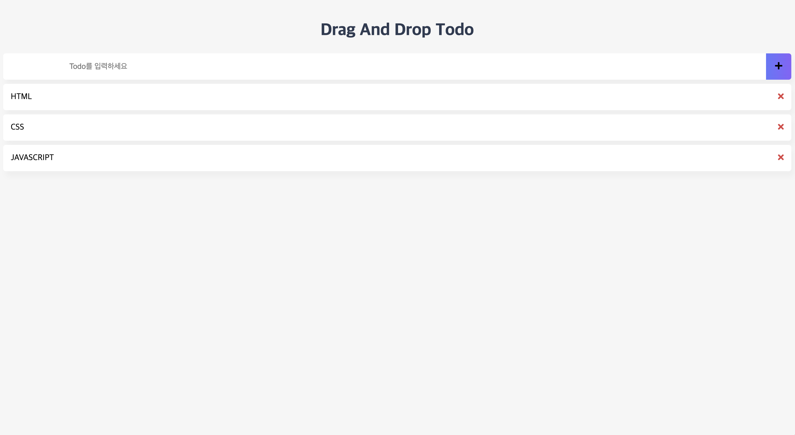

# Drag And Drop Todo

웹 프레임워크 없이 `Vanilla JS`로 구현한 `Drag And Drop`이 가능한 Todo App입니다.

🚀 [Demo App Link](https://2wndrhs.github.io/drag-and-drop-todo/)



## 프로젝트 폴더 구조

```bash
├── src
│   ├── controllers
│   │   └── Controller.js
│   ├── models
│   │   └── Store.js
│   ├── views
│   │   ├── View.js
│   │   ├── TodoFormView.js
│   │   └── TodoListView.js
│   ├── utils
│   └── index.js
├── style.css
└── index.html
```

## 목차

- 들어가며
- 배운 점
- 아쉬운 점

## 들어가며

웹 프레임워크를 사용하여 구현할 수도 있었지만 과제 구현에 주어진 시간이 짧아 웹 프레임워크 학습에 필요한 시간이 아깝다는 생각이 들어 `Vanilla JS`로 구현했습니다.

(~~그런 짓은 하지 말았어야 했는데~~)

그래도 과제를 구현하는 과정에서 많은 것들을 배울 수 있었습니다.

## 배운 점

- `addEventListener`에서의 `this` 바인딩
- `HTML Drag and Drop API`
- **웹 프레임워크의 소중함**

## 아쉬운 점

- 칸반보드 형식의 뷰를 구현하지 못한 것
  - `Vanilla JS`로 구현한다면 웹 컴포넌트를 구현하여 개발해야할 것 같습니다.
  - [Vanilla Javascript로 웹 컴포넌트 만들기](https://junilhwang.github.io/TIL/Javascript/Design/Vanilla-JS-Component/)
- 부족한 `CSS` 지식..
  - `CSS` 스타일링에 대한 추가적인 학습이 필요할 것 같습니다.
- Todo의 삭제 버튼의 `X` 아이콘을 정확히 클릭하면 삭제가 되지 않는 것
  - `이벤트 버블링`으로 인해 상위 요소에서 이벤트가 감지되어 삭제가 될 것이라 예상했는데 추가적인 학습이 필요할 것 같습니다 🥲
